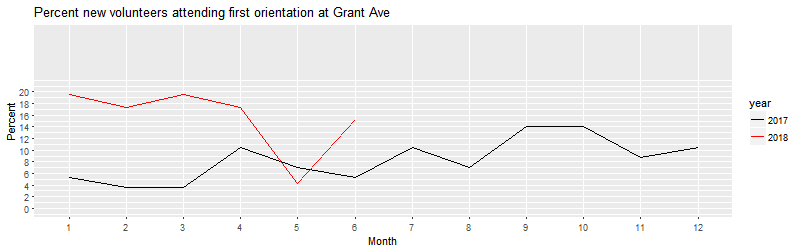
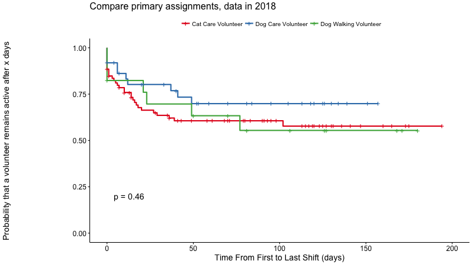

```{r setup, include=FALSE}
knitr::opts_chunk$set(echo = FALSE)
```

# Executive Summary
TBD

Specific suggestions for actions based on these findings are provided at the conclusion of the report.

# Contributors


R-Ladies Philadelphia is the Philadelphia chapter of R-Ladies, a worldwide organization to promote gender diversity in the community of statisticians, data miners, and programmers using the R programming language. The following data scientists contributed to the analysis for this report:

**Karla Fettich, PhD** is a psychologist and neuroscientist, and currently the Head of Algorithm Development at Orchestrall, Inc., where she develops algorithms to improve care in long-term care facilities. Karla is a PAWS dog care volunteer at Grays Ferry and served as the coordinator of the present R-Ladies / PAWS collaboration. 

**Alice Walsh, PhD** is a computational biologist and currently the Head of Analytics Innovation in Bioinformatics at Bristol-Myers Squibb. 

**Katerina Placek, MSc** is a neuroscience graduate student whose research focuses on anatomic and genetic factors underlying neural degeneration. 

**Kristen Nicholson, PhD** is a biomedical engineer and clinal research scientist at the Rothman Institute. She is also the VP of operations and brewer at the Point Breeze Brewing Company. 

\newpage
# Problem definition and dataset

This report is a follow-up analysis to the report from Q1 2018, with a focus on the first half of 2018 (Jan 1, 2018 - July 25, 2018), addressing the question from the previous report - **What can PAWS do to increase volunteer engagement and retention?** 

The data used for this round of analyses included 3 sets, obtained with PAWS permission: (1) the "master" dataset obtained from Volgistics, with names, addresses, and phone-numbers removed, and anonymized PAWS ID numbers, (2) the orientation signup sheet (from Google Docs), also de-identified, including orientation records between 1/1/2017 - 7/25/2018, (3) the "service" data obtained from Volgistics, de-identified. 

## Definitions
**New volunteers**: volunteers who recorded at least 1 shift of service


# Results: Engagement
## Attending Orientation

The graphs below show the distribution of orientation attendance for new volunteers over the course of a year, for 2017 (black line) and 2018 (red line, only until June 2018) at each of the 3 PAWS locations. To note, the numbers here do not reflect all orientation attendees, but only those orientation attendees who returned to complete at least 1 shift of service. The data from 2018 should be interpreted with caution, as the total number of new volunteers for 2018 contines to change. 

At Grays Ferry, January-February of 2018 show a higher number of new volunteer orientation attendees than March-April, a trend that differs from 2017. Similar to 2017, PAC maintained a relatively stable new volunteer orientation attendance throughout the first half of 2018, with a peak attendance in May. In contrast, Grant Ave experienced a dip in new volunteers attending orientation in May. A more in-depth analysis of what drives these patterns can be done - however, the scope of this analysis will need to be defined by PAWS. E.g., the impact of macro-level events can be assessed, e.g. specific changes in operations like the introduction of tablet sign-ins, orientation with mentorship, etc.; events like volunteer recruitment campaigns or other PAWS events; weather; etc. Additionally, more micro-level factors can also be explored, such as time of day/week of first shift, other volunteers present during first shift, etc. 




## Volgistics Sign-In Link
The next step of becoming a PAWS volunteer is to be sent a link from a PAWS staff member, with login information for Volgistics. 

 

The data indicate that once they attended orientation, new volunteers were typically emailed the Volgistics sign-up link 1-2 days later at PAC, 4-5 days later at Grays Ferry, and 8 days later at Grant Ave. The black lines indicate the numbers from 2017; thus, a small increase in duration is noted for PAC - Cat, GF - Basic, and GF - Basic + WD, while a decrease from 2017 is observed for Grant Ave Basic Orientation attendees.  

## Volunteer first sign-in into Volgistics

Similarly to 2017, in 2018 new volunteers signed into Volgistics within a day of receiving the email. 

## Volunteer completion of first shift

Compared to 2017, we notice a faster trajectory from orientation to shift 1 for new volunteers who completed PAC Cat, GF Basic, and NE Basic orientations. For PAC Dog orientations, this trajectory appears to be dramatically slower in 2018.

 

 

At **Grays Ferry**, new volunteers signed up for dog mentee shifts took longest to begin their service after orientation (approx. 23 days, increase from 20 days in 2017), while dog and cat care shifts saw volunteers starting approx. 15 days post orientation. 

At **Grant Ave**, new volunteers in dog walking shifts took approx. 2 days longer than in 2017 to begin their service, while both cat care and mentee shifts saw speedier engagement compared to last year. 

At **PAC**, new volunteers for dog walking took dramatically longer than last year to complete their first shift, while cat care volunteers were quicker to complete their first shift compared to last year. 

Finally, for volunteers who began their service at an **event**, the time between orientation and beginning of service increased compared to 2017.

## Factors contributing to a higher number of shifts served

TBD

## Mapping of volunteers

We re-ran the analyses mapping volunteers' ZIP codes in relation to their location of service on the data from 2018. As in the data from 2017, it appears that Grays Ferry and PAC attract volunteers from Center City, while Grant attracts volunteers from Northeast Philadelphia. However, there are some volunteers who appear to serve at locations that are quite far from their reported ZIP codes (e.g. PAC volunteers who live near the Philadelphia Airport, or in NE Phila). It may be possible to encourage these volunteers to sign up for (occasional) shifts at a closer location. 


# Results: Disengagement

All analyses in this section were performed for volunteers that did orientation between Jan 01 2018 and May 01 2018 in order to have a full mapping of their service timeline. 

First, we examined the total number of shifts served. 21% of orientation attendees at Grays Ferry have no record of service, while this number stands at 22% at Grant Ave, and 24% at PAC. This remains a fairly small percentage of volunteers, with the majority of new volunteers serving 2 or more shifts across all locations. Comparing to 2017 new volunteers is difficult because we have much longer follow-up time for these individuals and so it will naturally appear better. Overall, we expect the service trends to be similar in 2018 as 2017. The Grant Ave. data looks encouraging with more new volunteers serving shifts than last year. 

In this section, we considered a volunteer to be "disengaged" if more than 90 days passed since the date of their last recorded shift. From this 2018 volunteer pool, results suggest that approximately 27% of orientation attendees at any location disengage after orientation (which is a decrease from > 30% in 2017). 
\newpage


Similarly to 2017, taken across all locations, the delay between orientation and shift 1 does not appear to influence how long volunteers remain engaged.  



The analysis of disengagement probabilities for volunteers who signed up in 2018 indicates that these volunteers maintain a high likelihood of staying engaged (over ~70% probability), and there are insufficient drop-outs to determine whether the critical time periods identified in the last analysis still hold. Thus far, it appears that disengagement is lower compared to last year. 

\newpage
# Recommendations

TBD

\newpage

