```{r setup, include=FALSE}
knitr::opts_chunk$set(echo = FALSE)
```

# Executive Summary
PAWS locations often suffer from an insufficient number of volunteers available to cover the animal care needs. The core issue appears to be the engagement and retention of volunteers after orientation, rather than recruitment. The analyses in this report focused on PAWS volunteer data from 2017, and found that: 

1. There is an opportunity to speed up the timeline from initial interest to first shift, which would increase the number of shifts served per volunteer
2. Volunteers at PAC and Grays Ferry appear to come from similar areas (zip codes), and could potentially be incentivized to split their time between these two locations, 
3. Approximately 50% of orientation attendees at any location disengage after orientation and do not continue to serve even 1 shift
4. The risk of losing new volunteers is highest within roughly the first 100 days of service. Retention efforts could therefore target this time period specifically.

Specific suggestions for actions based on these findings are provided at the conclusion of the report.

# Contributors


R-Ladies Philadelphia is the Philadelphia chapter of R-Ladies, a worldwide organization to promote gender diversity in the community of statisticians, data miners, and programmers using the R programming language. The following data scientists contributed to the analysis for this report:

**Karla Fettich, PhD** is a psychologist and neuroscientist, and currently the Head of Algorithm Development at Orchestrall, Inc., where she develops algorithms to improve care in long-term care facilities. Karla is a PAWS dog care volunteer at Grays Ferry and served as the coordinator of the present R-Ladies / PAWS collaboration. 

**Alice Walsh, PhD** is a computational biologist and currently the Head of Analytics Innovation in Bioinformatics at Bristol-Myers Squibb. 

**Katerina Placek, MSc** is a neuroscience graduate student whose research focuses on anatomic and genetic factors underlying neural degeneration. 

**Kristen Nicholson, PhD** is a biomedical engineer and clinal research scientist at the Rothman Institute. She is also the VP of operations and brewer at the Point Breeze Brewing Company. 

\newpage
# Problem definition and dataset

This report is a follow-up analysis to the report from Q1 2018, with a focus on the first half of 2018 (Jan 1, 2018 - July 25, 2018), addressing the question from the previous report - **What can PAWS do to increase volunteer engagement and retention?** 

The data used for this round of analyses included 3 sets, obtained with PAWS permission: (1) the "master" dataset obtained from Volgistics, with names, addresses, and phone-numbers removed, and anonymized PAWS ID numbers, (2) the orientation signup sheet (from Google Docs), also de-identified, including orientation records between 1/1/2018 - 7/25/2018, (3) the "service" data obtained from Volgistics, de-identified. 

**New volunteers**: volunteers who recorded at least 1 shift of service


# Results: Engagement
## Attending Orientation

New volunteers who attended their first orientation at Grays Ferry tended to do so mostly in January/February and June (which is a different pattern from the March/April peaks in 2017). Similar to 2017, PAC maintained a relatively stable new volunteer orientation attendance throughout the first half of 2018, with a peak attendance in May. In contrast, Grant Ave experienced a dip in new volunteers attending orientation in May (while May was a peak month in 2017). 

A more in-depth analysis of what drives these patterns can be done - however, the scope of this analysis will need to be defined by PAWS. E.g., the impact of macro-level events can be assessed, e.g. specific changes in operations like the introduction of tablet sign-ins, orientation with mentorship, etc.; events like volunteer recruitment campaigns or other PAWS events; weather; etc. Additionally, more micro-level factors can also be explored, such as time of day/week of first shift, other volunteers present during first shift, etc. 

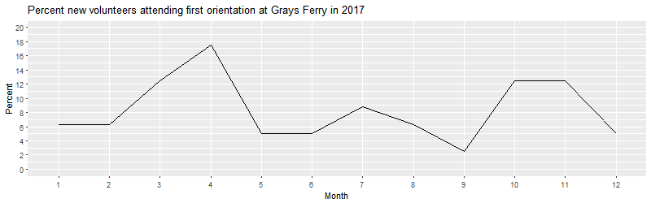
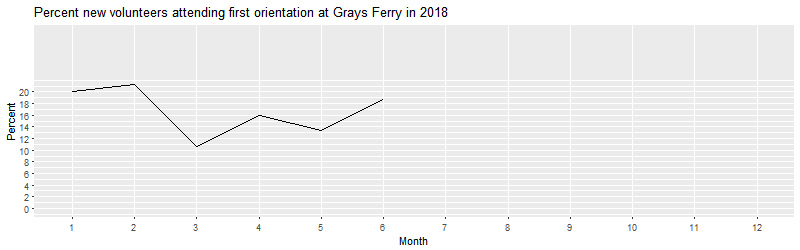

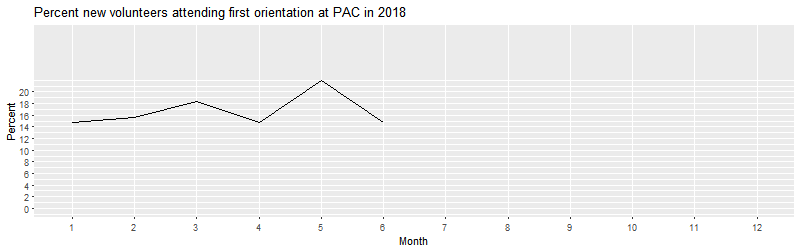


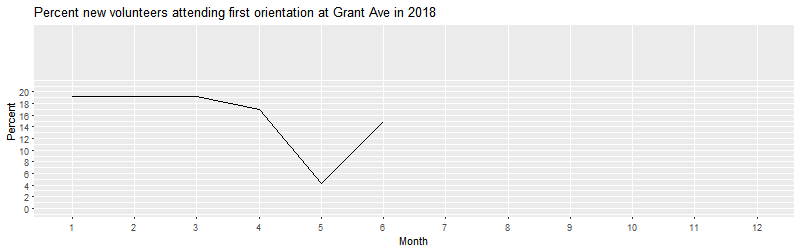

## Volgistics Sign-In Link
The next step of becoming a PAWS volunteer is to be sent a link from a PAWS staff member, with login information for Volgistics. 

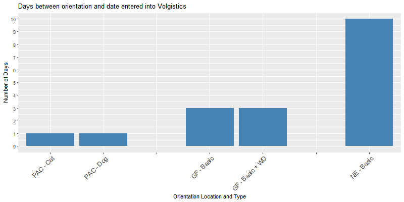 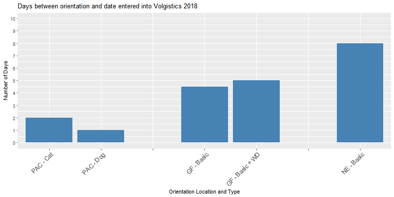

The data indicate that once they attended orientation, new volunteers were typically emailed the Volgistics sign-up link 1-2 days later at PAC, 4-5 days later at Grays Ferry (increased from 3 in 2017), and 8 days later at Grant Ave (decreased from 10 in 2017).   

## Volunteer first sign-in into Volgistics

Similarly to 2017, new volunteers signed into Volgistics within a day of receiving the email. 

## Volunteer completion of first shift

The data indicate that new volunteers who completed PAC orientation typically began their service 16 days later (dog; increase from 9 in 2017) and 12 days later (cat; decrease from 14 in 2017). At Grays Ferry, volunteers from basic orientation started service 14 days later (decrease from 17 in 2017) and volunteers from basic + WD orientations typically started their service 19 days later (increase from 17); at Grant Ave, volunteers began their service 20 days after orientation (decrease from 21 in 2017). 

 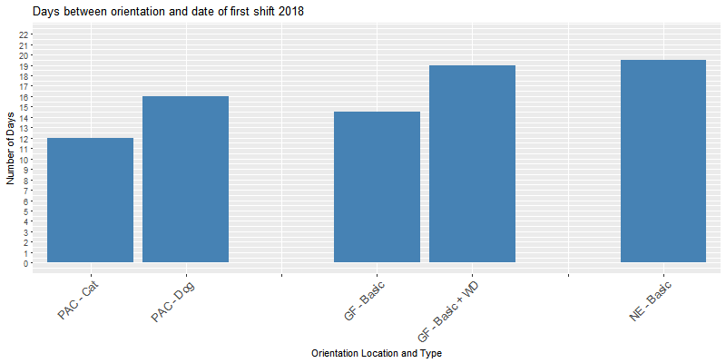 

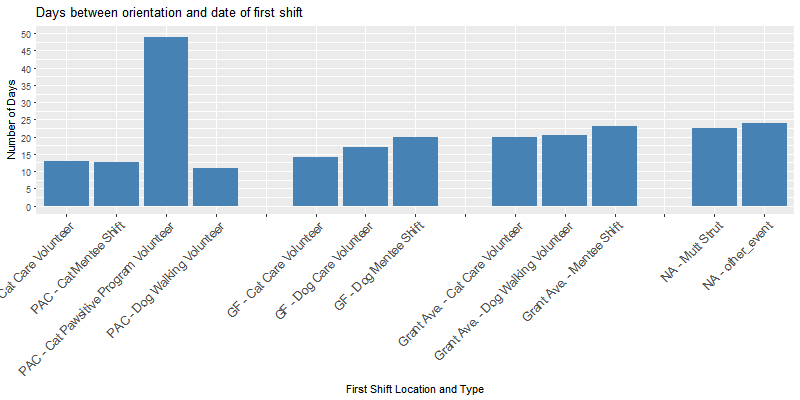 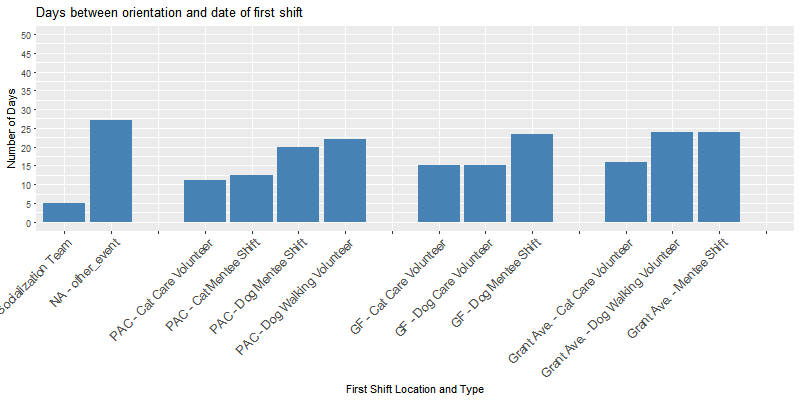

The **Cat Pawsitive Program** saw volunteers starting their first shift approx. 27 days from orientation, a dramatic decrease from 2017 (49 days from orientation).

At **PAC**, time to first shift was longest for volunteers who started their service in dog shifts (dog walking or dog mentee), approx. 20 days post orientation, an increase from 11 days in 2017. This duration was only approx. 13 days for Cat Care volunteer and Cat Mentee shifts (same as in 2017). 

At **Grays Ferry**, new volunteers signed up for dog mentee shifts took longest to begin their service after orientation (approx. 23 days, increase from 20 days in 2017), while dog and cat care shifts saw volunteers starting approx. 15 days post orientation (decrease from 17 days for dogs, increase from 14 days for cats). 

At **Grant Ave**, new volunteers signed up for mentee shifts and dog walking shifts also took longest to begin their service after orientation (almost 25 days, increase from 23 in 2017), followed by cat care volunteers (approx. 16 days, decrease from 20 days in 2017). Finally, for volunteers who began their service at an **event**, the time between orientation and beginning of service was typically 27 days.

## Factors contributing to a higher number of shifts served

We also performed an initial analysis to assess what factors may contribute to a higher number of shifts served per volunteer. We found that the shorter the time between orientation and shift 1, the more likely it was that a volunteer would serve a greater number of shifts. Furthermore, volunteers who served as event staff, adoptions assistants, cat care volunteers, cat pawsitive program volunteers, dog walking volunteers and veterinary tech volunteer, had a higher likelihood of signing up for more shifts. 

It is interesting to note that dog care volunteer shifts (which only exist at Grays Ferry and which struggle the most with lack of available volunteers) do not increase the likelihood that a volunteer will serve a higher number of shifts. This may indicate that there is something particularly challenging about these shifts. In order to solve the problem of volunteer availability at Grays Ferry, it may be worth examining what is different about the dog walking shifts at PAC and Grant Ave. It also may be worth considering introducing an incentives program for dog walking volunteers to serve a minimum number of shifts as dog care volunteers at Grays Ferry. 

## Mapping of volunteers

We explored where volunteers at each location come from. For the purpose of this analysis, we used zip codes to inform where volunteers live, and we limited the dataset to volunteers who completed orientations between January 1st, 2017 and September 1st, 2017, and who recorded at least 1 shift in Volgistics.


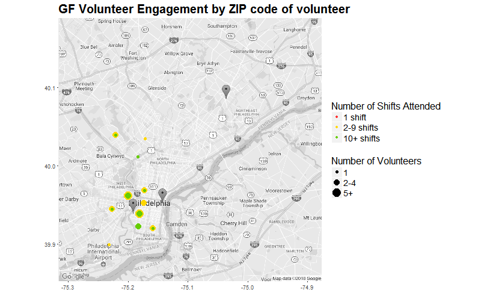

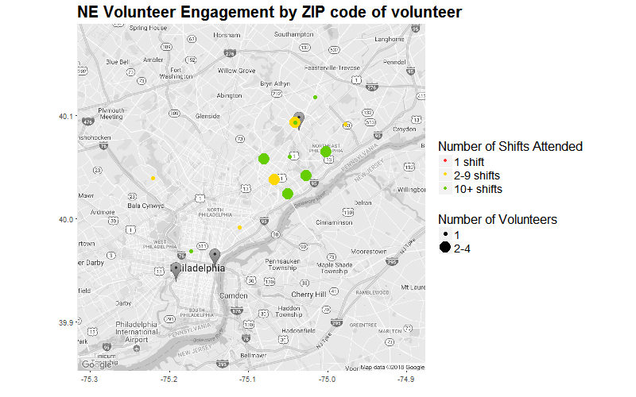


It appears to be the case that the Grant Ave location attracts volunteers from North Philadelphia and Northeast Philadelphia, while PAC and GF share a more localized pool of volunteers from the Center City, South Philadelphia and West Philadelphia area. Given this, one possibility to attract more volunteers to the Grays Ferry location may be to encourage PAC volunteers to also serve at Grays Ferry. 

# Results: Disengagement

In this section, we considered a volunteer to be disengaged if more than 90 days passed since the date of their last recorded shift. All analyses in this section were performed for volunteers that did orientation between Jan 01 2017 and Sept 01 2017 in order to have a full mapping of their service timeline. 

From this volunteer pool, initial results suggest that approximately 50% of orientation attendees at any location disengage after orientation. Specifically, 55% of orientation attendees at Grays Ferry (71 attendees) have no record of service, while this number stands at 50.5% (46 attendees) at Grant Ave, and 46.8% (94 attendees) at PAC. If half of people attending orientations will not return, then they are blocking other, potentially more motivated new volunteers from beginning their service. The reasons for this attrition after orientation are not clear, but these numbers indicate that it is worth exploring avenues for optimizing the orientation system in a way that yields less attrition at this stage. One option would be to request more details from people when they sign up for orientation, with regard to their intentions and availabilities for volunteer service. This information could then be used to prioritize who gets to attend orientation at what time. 

We also found that it is unlikely for a new volunteer to attend only one shift, and then disengage. Specifically, only a small percentage of orientation attendees had only 1 shift recorded (4.7% at Grays Ferry = 6 volunteers; 6.6% at Grant Ave = 6 volunteers; 7.5% at PAC = 15 volunteers). The majority of volunteers served 2 or more shifts, across all locations. This suggests that new volunteers have the motivation to serve at PAWS repeatedly, and the challenge may be how to best place and retain them for longer-term service.
\newpage
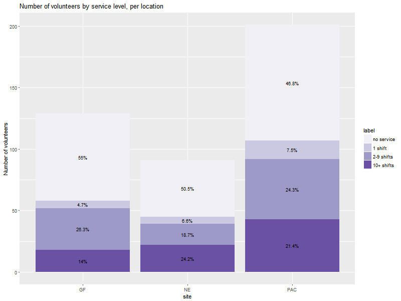


Interestingly, taken across all locations, the delay between orientation and shift 1 is not sufficient to estimate when volunteers become disengaged, even though the engagement analysis suggests that the longer this delay, the fewer shifts volunteers attend. In this dataset, we did not observe a significant relationship between the delay between orientation and volunteering and how long, in time, the volunteer continues to volunteer at PAWS. Furthermore, we found that whether a volunteer serves multiple times a week, once every 2 weeks, or more sporadically than every 2 weeks, this pattern is not an indicator for disengagement. It could be that the patterns of engagement frequency observed by staff, and in the data, can guide the options given to new volunteers when they first sign up (e.g. "Would you like to serve: a) weekly, b) monthly, c) every once in a while/events only").

We also examined disengagement patterns between volunteers whose primary assignment is 'cat care', 'dog care', and 'dog walking'. The data suggest that dog walking volunteers (PAC or NE) are more likely to serve for an overall duration than cat care (all locations) and dog care (GF) volunteers. Furthermore, the risk of losing dog walking volunteers is highest within the first 60 days, while the risk of losing cat care and dog care volunteers is highest in the first 100 days of service.

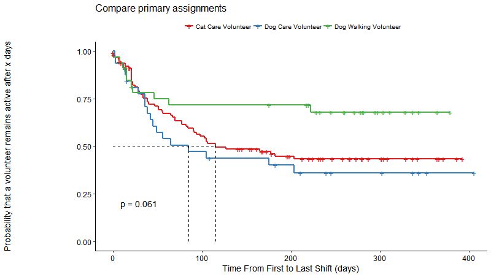 


The data suggest that PAWS is most likely to lose new volunteers in their first 60 days of service (dog walking) or 100 days (cat care, dog care). This information could guide the timeline of retention efforts, so that retention efforts are highest in a volunteer's first 60-100 days of service.

\newpage
# Recommendations

**1. Collect additional information when new volunteers sign up for orientation in order to assess which factors drive recruitment of reliable volunteers.** This information could include items such as 
- Where did you hear about PAWS? 
- What led you to become a volunteer at this time?
- What is your occupation? 
R-Ladies has the opportunity to access demographic data based on zip codes, and could therefore do a more thorough analysis of existing volunteers characteristics based on zip codes. If this is of interest to PAWS, this area could be explored further. 

**2. Reduce the time it takes for volunteers to be entered into Volgistics by staff.** 

**3. Reduce the steps necessary for a new volunteer to begin their service.** Currently, someone who is interested in volunteering at PAWS has to go through a 4-step process (orientation, volgistics registration by staff, sign-in to Volgistics and sign-up for 1st shift, completion of first shift). It may be worth considering a process whereby new volunteers can skip the orientation and instead, begin their service with a mentee shift. Such a solution would not only reduce the time between initial interest and first day of service, but would also help fill shifts where they are needed. 

**4. Consider introducing an incentives program for dog walking volunteers to serve a minimum number of shifts as dog care volunteers at Grays Ferry**.

**5. Request more details from people when they sign up for orientation, with regard to their intentions and availabilities for volunteer service.** This information could then be used to prioritize who gets to attend orientation at what time. For example, new volunteers could be asked whether they would like to, or be able to serve a) weekly, b) monthly, c) every once in a while/events only. 

**6. Collect data on challenges faced by volunteers, and disengagement reasons.** It is likely that challenges faced by volunteers result, over time, to disengagement. Quantifying the impact of these challenges may be useful in prioritizing the challenges to address. Additionally, it may be worth reaching out to disengaged volunteers by email with very short, easy to answer questions regarding their reasons. 

\newpage

