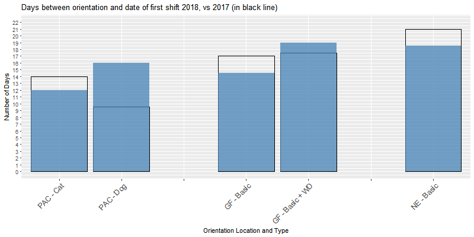
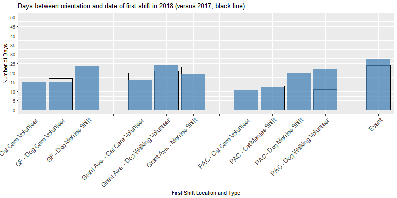
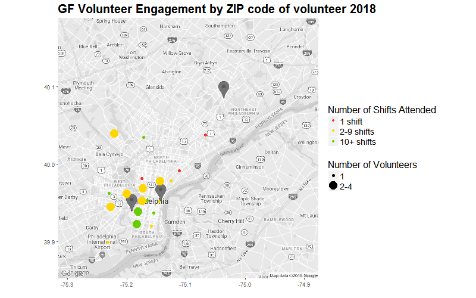
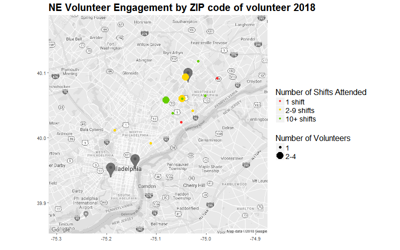

```{r setup, include=FALSE}
knitr::opts_chunk$set(echo = FALSE)
```
# Executive Summary
The present report is an update to the report from April 22, 2018, with PAWS volunteer statistics from the first half of 2018 in comparison to updated statistics from 2017. The following conclusions can be drawn:

1. Speeding up the timeline from orientation to first shift remains an opportunity to engage volunteers and increase the likelihood that they will serve more shifts. This range is currently 12-18 days across all locations.
2. Mentee shifts have become a more significant predictor of volunteer engagement in volunteers who completed orientation in 2018: While in 2017 volunteers, PAC Cat Mentee assignments, Grays Ferry Dog Mentee assignments and PAC Dog Mentee assignments did not impact volunteer engagement, in 2018 volunteers we observe that participation in these assignments increases the likelihood of serving more shifts.
3. Approximately 27% of orientation attendees at any location disengage after orientation. This is a decrease from > 30% in 2017).
4. Overall disengagement appears to be lower than last year,  with 2018 volunteers maintaining a high likelihood of staying engaged (over ~70% probability). 
5. Introducing tablets in February 2017 may have facilitated more accurate recording of shifts.

# Contributors

 R-Ladies Philadelphia is the Philadelphia chapter of R-Ladies, a worldwide organization to promote gender diversity in the community of statisticians, data miners, and programmers using the R programming language. The following data scientists contributed to the analysis for this report:

**Karla Fettich, PhD** is a psychologist and neuroscientist, and currently the Head of Algorithm Development at Orchestrall, Inc., where she develops algorithms to improve care in long-term care facilities. Karla is a PAWS dog care volunteer at Grays Ferry and served as the coordinator of the present R-Ladies / PAWS collaboration. 

**Alice Walsh, PhD** is a computational biologist and currently the Head of Analytics Innovation in Bioinformatics at Bristol-Myers Squibb. 

**Katerina Placek, MSc** is a neuroscience graduate student whose research focuses on anatomic and genetic factors underlying neural degeneration. 

# Problem definition and dataset

This report is a follow-up analysis to the report from Q1 2018, with a focus on the first half of 2018 (Jan 1, 2018 - July 25, 2018), addressing the question from the previous report - **What can PAWS do to increase volunteer engagement and retention?** - but also assessing whether volunteer engagement and retention has changed in 2018, in comparison to 2017. The data used was obtained with PAWS permission and included (1) the anonymized "master" dataset from Volgistics, (2) the anonymized orientation signup sheet (from Google Docs), and (3) the anonymized "service" data from Volgistics. 

\newpage

# Results: Engagement
## Attending Orientation
The graphs below show the distribution of orientation attendance for new volunteers (orientation attendees who completed at least 1 shift) over the course of a year, for 2017 (black line) and 2018 (red line, only until June 2018) at each PAWS location.


At Grays Ferry, January-February of 2018 show a higher number of new volunteer orientation attendees than March-April, a trend that differs from 2017. Similar to 2017, PAC maintained a relatively stable new volunteer orientation attendance throughout the first half of 2018, with a peak attendance in May. In contrast, Grant Ave experienced a dip in new volunteers attending orientation in May.

## Volgistics Sign-In Link
In the graphs below, the black line bar indicates 2017 data, while the filled blue bar represents 2018 data.

 Once they attended orientation, new volunteers were typically emailed the Volgistics sign-up link 1-2 days later at PAC, 4-5 days later at Grays Ferry, and 8 days later at Grant Ave. A small increase from 2017 is noted for PAC - Cat, GF - Basic, and GF - Basic + WD, while a decrease from 2017 is observed for Grant Ave Basic Orientation attendees. Similarly to 2017, in 2018 new volunteers signed into Volgistics within a day of receiving the email. 

## Volunteer completion of first shift
Compared to 2017, we notice a faster trajectory from orientation to shift 1 for new volunteers who completed PAC Cat, GF Basic, and NE Basic orientations. For PAC Dog orientations, this trajectory appears to be dramatically slower in 2018, increasing from approx. 10 days to approx. 16 days.

 
 

At **Grays Ferry**, new volunteers signed up for dog mentee shifts took longest to begin their service after orientation (approx. 23 days, increase from 20 days in 2017), while dog and cat care shifts saw volunteers starting approx. 15 days post orientation. 

At **Grant Ave**, new volunteers in dog walking shifts took approx. 2 days longer than in 2017 to begin their service, while both cat care and mentee shifts saw speedier engagement compared to last year. 

At **PAC**, new volunteers for dog walking took dramatically longer than last year to complete their first shift, while cat care volunteers were quicker to complete their first shift compared to last year. 

Finally, for volunteers who began their service at an **event**, the time between orientation and beginning of service increased compared to 2017.

## Factors contributing to a higher number of shifts served

Overall, the factors that contributed to volunteers serving a higher number of shifts in 2018 were comparable to the 2017 data, in that living in Philadelphia did not have a significant impact on the number of shifts served, while time from orientation to shift 1 did (longer time to shift 1 being correlated with fewer shifts served). 

In our previous report, we analyzed the impact of different assignments on number of shifts served, and we noted that volunteers who served as event staff, adoptions assistants, cat care volunteers, cat pawsitive program volunteers, dog walking volunteers and veterinary tech volunteers had a higher likelihood of signing up for more shifts. We update these likelihood estimates with additional service data from 2018, and ran the analyses for both volunteers who completed orientation in 2017 and those who completed orientation in 2018, separately. The findings differ somewhat from those of the previous report in light of new data: 

* Cat Care Volunteer assignments across all 3 locations increased the likelihood of serving more shifts in both 2017 volunteers and 2018 volunteers.
* Cat Mentee assignments at PAC increased the likelihood of serving more shifts in 2018 volunteers, but not in 2017 volunteers.
* Cat Pawsitive Program assignments had no impact on shifts served at Grant Ave, but increased the likelihood of serving more shifts at PAC in both 2017 and 2018. 
* Cat Socialization Team assignments did not impact number of shifts served in 2017, but increased the likelihood of serving more shifts in 2018. 
* Dog Care assignments at Grays Ferry increased the likelihood of serving more shifts in both 2017 volunteers and in 2018 volunteers. In our previous report, this effect was not observed, and we believe this change is due to the additional service data from 2018.
* Dog Mentee assignments at both Grays Ferry and PAC did not significantly affect the number of shifts served for 2017 volunteers, but increased the likelihood of serving more shifts for 2018 volunteers at both locations. 
* Dog Walking assignments increased the likelihood of serving more shifts in both 2017 volunteers and in 2018 volunteers, at both Grant Ave and PAC.
* Grant Ave Mentee shifts also increased the likelihood of serving more shifts in both 2017 volunteers and in 2018 volunteers. 

## Mapping of volunteers

We re-ran the analyses mapping volunteers' ZIP codes in relation to their location of service on the data from 2018. As in the data from 2017, it appears that Grays Ferry and PAC attract volunteers from Center City, while Grant attracts volunteers from Northeast Philadelphia. However, there are some volunteers who appear to serve at locations that are quite far from their reported ZIP codes (e.g. PAC volunteers who live near the Philadelphia Airport, or in NE Phila).





# Results: Disengagement

All analyses in this section were performed for volunteers that completed orientation between Jan 01 2018 and May 01 2018 in order to have a more complete mapping of their service timeline. 

First, we examined the total number of shifts served. 21% of orientation attendees at Grays Ferry have no record of service, while this number stands at 22% at Grant Ave, and 24% at PAC. This remains a fairly small percentage of volunteers, with the majority of new volunteers serving 2 or more shifts across all locations. Comparing to 2017 new volunteers is difficult because we have much longer follow-up time for these individuals and so it will naturally appear better. Overall, we expect the service trends to be similar in 2018 as 2017. The Grant Ave. data looks encouraging with more new volunteers serving shifts than last year. 

In this section, we considered a volunteer to be "disengaged" if more than 90 days passed since the date of their last recorded shift. From this 2018 volunteer pool, results suggest that approximately 27% of orientation attendees at any location disengage after orientation (which is a decrease from > 30% in 2017). Similarly to 2017, taken across all locations, the delay between orientation and shift 1 does not appear to influence how long volunteers remain engaged.


We noted that the 2017 numbers with updated service data from 2018 differ substantially from the numbers shown in the previous report. We believe this to be an effect of volunteers recording their shifts more, potentially as a result of the introduction of tablets. We therefore chose to also present here the cumulative number of service reports filed by volunteers via website or via tablet, split into 2 groups (volunteers who completed orientation in 2017 and volunteers who completed orientation in 2018). 


In both volunteers who started in 2017 and in those who started in 2018, we observe a spike in recording starting in February 2018. 

The analysis of disengagement probabilities for volunteers who signed up in 2018 indicates that these volunteers maintain a high likelihood of staying engaged (over ~70% probability), and there are insufficient drop-outs to determine whether the critical time periods identified in the last analysis still hold. Thus far, it appears that disengagement is lower compared to last year. 


\newpage
# Recommendations

TBD

\newpage

