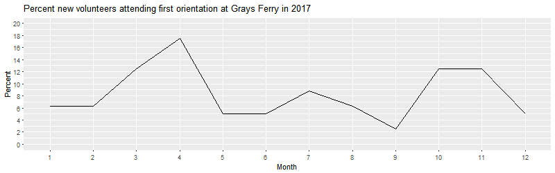
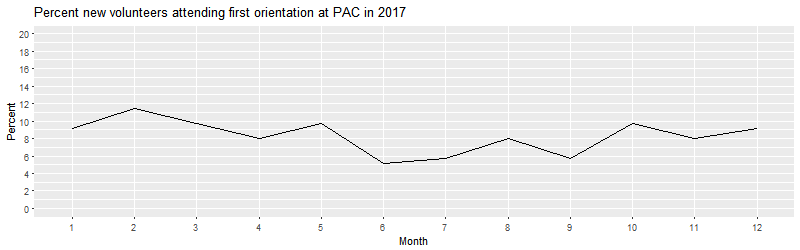
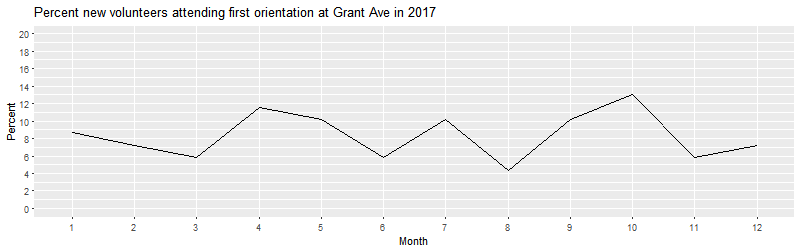
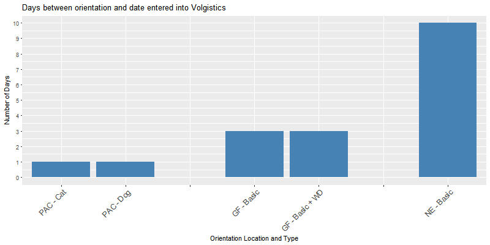
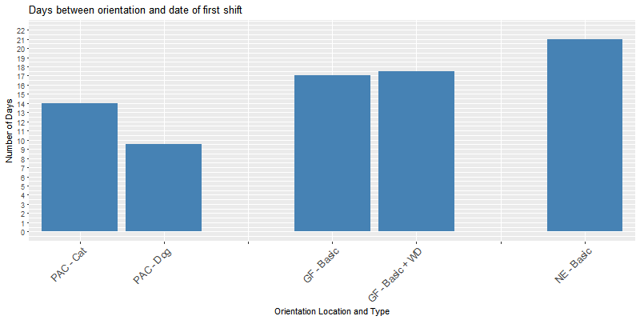
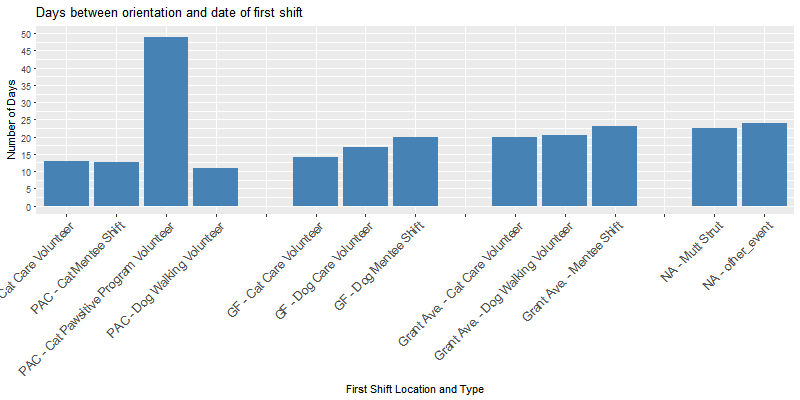
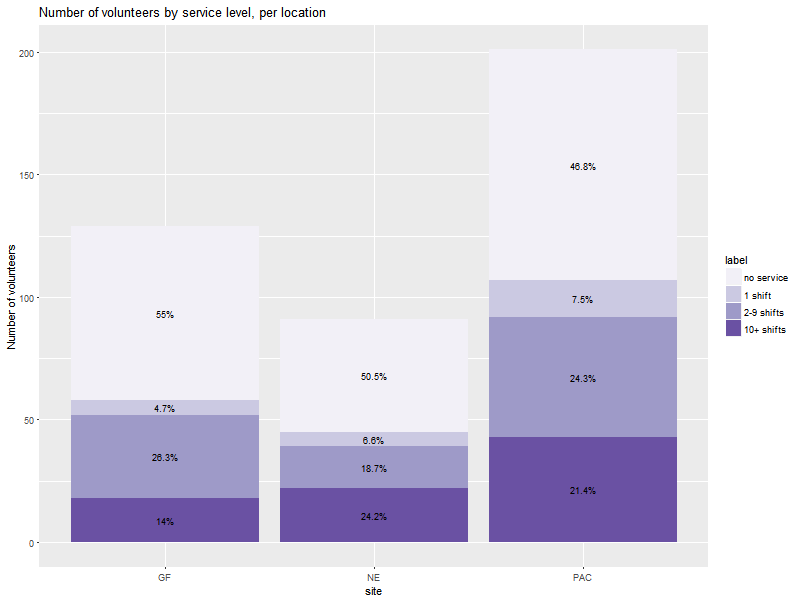
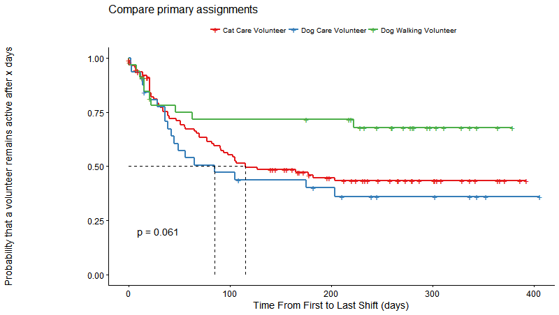

```{r setup, include=FALSE}
knitr::opts_chunk$set(echo = FALSE)
```

# Executive Summary

\newpage
# Problem definition and dataset

Observations by volunteers and staff suggest that PAWS locations often suffer from an insufficient number of volunteers available to cover the animal care needs, and that the core issue appears to be the engagement and retention of volunteers after orientation, rather than recruitment. Therefore, these initial analyses by R-Ladies Philly sought to find answers to the following main problem: **What can PAWS do to increase volunteer engagement and retention?** 

In order to better understand this problem, we analyzed the data to gain a better understanding of the following volunteer behavior patterns and the factors that may influence them: 1. Engagement (e.g. when do new volunteers sign up, how long before they actually attend their first shift), and 2. Disengagement (e.g. why do volunteers stop coming in for shifts).

The data used for this round of analyses included 3 sets, obtained with PAWS permission: (1) the "master" dataset obtained from Volgistics, with names, addresses, and phone-numbers removed, and anoymized PAWS ID numbers, (2) the orientation signup sheet (from Google Docs), also de-identified, including orientation records between 1/1/2017 - 3/1/2018, (3) the "service" data obtained from Volgistics, de-identified. 

We purposefully did not include data from previous years in these analyses in order to keep the dataset small enough that we could focus on a deep understanding of the data, and to establish a basis to discuss more in-depth analyses.  

# Results: Engagement
## Attending Orientation

Currently, the first step of becoming a PAWS volunteer is to attend orientation. It is therefore assumed that attending orientation is the first indication that a potential volunteer is motivated to donate their time to PAWS and has availability to do so. The new volunteer orientation attendance data from 2017 suggest that there are 'seasons' when more people are motivated to become volunteers at PAWS, and that these seasons are not the same across the three PAWS locations.  

New volunteers (volunteers who recorded at least 1 shift of service) who attended their first orientation at Grays Ferry tended to do so mostly in March/April and October/November. At PAC, there appears to be a stable new volunteer orientation attendance, with slower months being June, July and September. In contrast, Grant Ave had new volunteer orientation attendance peaks in April, May, July, September and October. 

It is unclear what drives these patterns. It could be PAWS volunteer recruitment efforts, increased visibility of PAWS events (e.g. Mutt Strut in October), seasonal changes in availability (e.g. academic calendar), or demographic characteristics. What is clear, however, is that there are months when motivation to begin volunteering at PAWS is higher, and the opportunity to retain volunteers is therefore also greater. 






## Being entered into Volgistics
The next step of becoming a PAWS volunteer is to be entered into Volgistics by a staff member.

 

The data indicate that once they attended orientation, new volunteers were typically entered into Volgistics 1 day later at PAC, 3 days later at Grays Ferry, and 10 days later at Grant Ave. Since this process is not dependent on unknown volunteer factors and is entirely owned by PAWS staff, it may be beneficial to apply insights from PAC to the other two locations in order to speed up this process.  

## Volunteer first sign-in into Volgistics

The third step in the process of becoming a new volunteer at PAWS is to sign in to Volgistics for the first time and sign up for a shift. This sign-in can only happen after a volunteer was entered into Volgistics by a staff member, so any delay in entering volunteers into the system necessarily means delays in new volunteers' ability to sign up for shifts. The data show that once entered into the system, the majority of new volunteers across all locations signed into Volgistics on the same day. 

## Volunteer completion of first shift

The fourth step in the process of becoming a new volunteer at PAWS is to serve a first shift. The volunteer has full flexibility in choosing a day and shift for their first shift, as long as the chosen shift is aligned with their orientation, and is not already scheduled to capacity in Volgistics. 

The data indicate that new volunteers who completed PAC orientation typically began their service 9 days later (dog) and 14 days later (cat). At Grays Ferry, volunteers from both basic and basic + WD orientations typlically started their service 17 days later, while at Grant Ave, volunteers began their service 21 days after orientation. 



Type of shift was also informative with regard to the typical duration between orientation and shift 1. For new volunteers who started their service doing administrative tasks, the typical time between orientation and shift 1 was 114 days. Similarly, for first shifts that were vet tech shifts, this duration was 137 days. These numbers are disproportionately high compared to other volunteer assignments and are therefore not shown in the graph above.  



At **PAC**, time to first shift was longest for volunteers who started their service in the Cat Pawsitive Program (49 days from orientation), while this duration was only 13 days for Cat Care volunteer and Cat Mentee shifts, and 11 days for Dog Walking Volunteer shifts. 

At **Grays Ferry**, new volunteers signed up for dog mentee shifts took longest to begin their service after orientation (20 days), followed by dog care volunteer shifts (17 days) and cat care volunteers (14 days). At **Grant Ave**, new volunteers signed up for mentee shifts also took longest to begin their service after orientation (23 days), followed by dog and cat care volunteers (20 days). Finally, for volunteers who began their service at an **event**, the time between orientation and beginning of service was typically 22 days (Mutt Strut) and 24 days (other event).

## Factors contributing to a higher number of shifts served

We also performed an initial analysis to assess what factors may contribute to a higher number of shifts served per volunteer. We found that the shorter the time between orientation and shift 1, the more likely it was that a volunteer would serve a greater number of shifts. Furthermore, volunteers who served as event staff, adoptions assistants, cat care volunteers, cat pawsitive program volunteers, dog walking volunteers and veterinary tech volunteer, had a higher likelihood of signing up for more shifts. 

It is interesting to note that dog care volunteer shifts (which only exist at Grays Ferry and which struggle the most with lack of available volunteers) do not increase the likelihood that a volunteer will serve a higher number of shifts. This may indicate that there is something particularly challenging about these shifts. In order to solve the problem of volunteer availability at Grays Ferry, it may be worth examining what is different about the dog walking shifts at PAC and Grant Ave. It also may be worth considering introducing an incentives program for dog walking volunteers to serve a minimum number of shifts as dog care volunteers at Grays Ferry. 


# Results: Disengagement

In this section, we considered a volunteer to be disengaged if more than 90 days passed since the date of their last recorded shift. All analyses in this section were performed for volunteers that did orientation between Jan 01 2017 and Sept 01 2017 in order to have a full mapping of their service timeline. 

From this volunteer pool, initial results suggest that approximately 50% of orientation attendees at any location disengage after orientation. Specifically, 55% of orientation attendees at Grays Ferry (71 attendees) have no record of service, while this number stands at 50.5% (46 attendees) at Grant Ave, and 46.8% (94 attendees) at PAC. If 50% of people attending orientations will not return, then they are blocking other, potentially more motivated new volunteers from beginning their service. The reasons for this attrition after orientation are not clear, but these numbers indicate that it is worth exploring avenues for optimizing the orientation system in a way that yields less attrition at this stage. One option would be to request more details from people when they sign up for orientation, with regard to their intentions and availabilities for volunteer service. This information could then be used to prioritize who gets to attend orientation at what time. 

Only a small percentage of orientation attendees had only 1 shift recorded (4.7% at Grays Ferry = 6 volunteers; 6.6% at Grant Ave = 6 volunteers; 7.5% at PAC = 15 volunteers). The majority of volunteers served 2 or more shifts, across all locations. 



Interestingly, taken across all locations, the delay between orientation and shift 1 is not sufficient to estimate when volunteers become disengaged. In this dataset, we did not observe a significant relationship between the delay between orientation and volunteering and how long the volunteer continues to volunteer at PAWS. Furthermore, we found that whether a volunteer serves multiple times a week, once every 2 weeks, or more sporadically than every 2 weeks, this pattern is not an indicator for disengagement. 

We also examined disengagement patterns between volunteers whose primary assignment is 'cat care', 'dog care', and 'dog walking'. The data suggest that dog walking volunteers (PAC or NE) are more likely to serve for a overall duration than cat care (all locations) and dog care (GF) volunteers. Furthermore, the risk of losing dog walking volunteers is highest within the first 60 days, while the risk of losing cat care and dog care volunteers is highest in the first 100 days of service.



\newpage
# Conclusions and Recommendations

We did not extensively examine all the patterns of volunteer disengagement and factors that led to a volunteer leaving. Overall, the largest drop-out appears to be that volunteers never show up after doing the orientation. If a volunteer does show up, then they tend to volunteer more than once. The Gray's Ferry location is having the hardest time retaining volunteers and their volunteers tend to volunteer less than other locations.

\newpage
# Recommendations

**1. Collect additional information when new volunteers sign up for orientation in order to assess which factors drive recruitment of reliable volunteers.** This information could include items such as 
- Where did you hear about PAWS? 
- What led you to become a volunteer at this time?
- What is your occupation? 
R-Ladies has the opportunity to access demographic data based on zip codes, and could therefore do a more thorough analysis of existing volunteers characteristics based on zip codes. If this is of interest to PAWS, this area could be explored further. 

**2. Reduce the time it takes for volunteers to be entered into Volgistics by staff.** 

**3. Reduce the steps necessary for a new volunteer to begin their service.** Currently, someone who is interested in volunteering at PAWS has to go through a 4-step process (orientation, volgistics registration by staff, sign-in to Volgistics and sign-up for 1st shift, completion of first shift). It may be worth considering a process whereby new volunteers can skip the orientation and instead, begin their service with a mentee shift. Such a solution would not only reduce the time between initial interest and first day of service, but would also help fill shifts where they are needed. 

**4. Consider introducing an incentives program for dog walking volunteers to serve a minimum number of shifts as dog care volunteers at Grays Ferry**.

** 5. Request more details from people when they sign up for orientation, with regard to their intentions and availabilities for volunteer service.** This information could then be used to prioritize who gets to attend orientation at what time. 

\newpage
# About R-Ladies Philadelphia

R-Ladies Philadelphia is the Philadelphia chapter of R-Ladies, a worldwide organization to promote gender diversity in the community of statisticians, data miners, and programmers using the R programming language.

# Contributors

