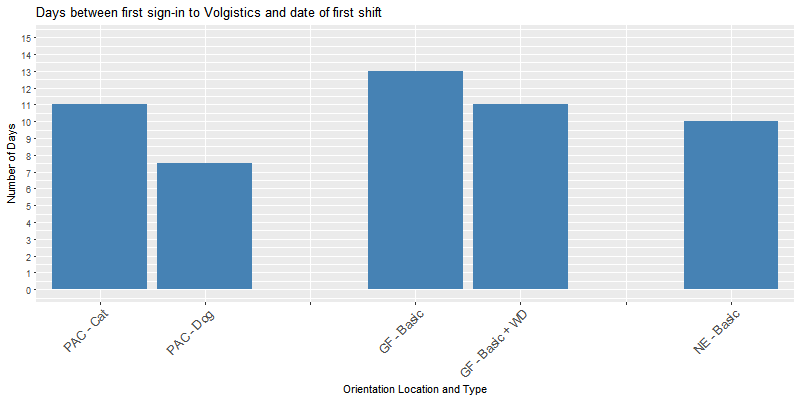
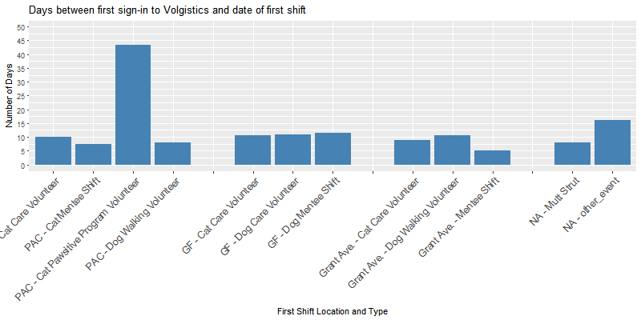

```{r setup, include=FALSE}
knitr::opts_chunk$set(echo = TRUE)
```

# Executive Summary

\newpage
# Problem definition and dataset

## Problem definition
The primary problem addressed in this first phase of data analysis was: **What can PAWS do to increase volunteer engagement and retention?** This problem was broken into the following sub-questions:

1. What is the typical engagement timeline for a volunteer, from attending orientation to completing first shift?
2. What is the typical volunteer behavior in the first month? In the first 2 months?
3. What is the typical pattern for volunteer disengagement?
4. What factors contribute to a volunteer returning after shift 1? e.g. time of first shift attended; day/month/season of first shift attended; who else/how many others were there during first shift attended; zip code; initial engagement pattern; sign-up pattern in first month;
5. What factors contribute to a volunteer becoming a regular? e.g. time of first shift attended; day/month/season of first shift attended; who else/how many others were there during first shift attended; zip code; initial engagement pattern; sign-up pattern in first month;

## Dataset

The data used for this round of analyses included 3 datasets: 
* the "master" dataset obtained from Volgistics, with names, addresses, and phone-numbers removed, and anoymized PAWS ID numbers. 
* the orientation signup sheet (from Google Docs), also de-identified, including orientation records between 1/1/2017 - 3/1/2018
* the "service" data obtained from Volgistics, de-identified. 


\newpage
# Results
## Typical volunteer engagement timelines

The time it takes for volunteers to be entered into the system after attending orientation at each location is consistent within each location, regardless of orientation type (cat vs. dog at PAC; basic vs basic + WD at GF). Typically, at PAC, volunteers who attend their first orientation were entered into the system the following day; at Grays Ferry, 3 days later; and at Grant Ave, 10 days later. 


Furthermore, across all locations, volunteers sign into Volgistics on the day they are added to the system. 

With regard to how long it takes for a volunteer to attend their first shift, the typical timeline varies by orientation location and type. Volunteers who attend the PAC Cat orientation begin their first shift 11 days after signing on to the system (that is, 12 days after orientation), while volunteers who attend the PAC Dog orientation attend their first shift 7.5 days after logging into the system (i.e., 8.5 days after orientation). 

At Grays Ferry, volunteers who attend only the Basic orientation begin their first shift 13 days after signing on to the system (that is, 16 days after orientation), while volunteers who attend the combined Basic & Working Dog orientation attend their first shift 11 days after logging into the system (i.e., 14 days after orientation).

At Grant Ave, volunteers who attend orientation begin their first shift 10 days after signing on to the system (that is, 20 days after orientation).



The typical duration between a volunteer's first orientation and their first shift also depends on what their first shift is. The median time between first time logging on to Volgistics and first shift, where first shift was administrative tasks, was 114 days. Similarly, the median wait time for vet tech volunteers at PAC was 137 days from first login to Volgistics. These numbers are disproportionately high compared to other volunteer assignments and are therefore not shown in the graph below.  

At PAC, time to first shift is longest for volunteers who have their first shift in the Cat Pawsitive Program (43.5 days from login), while first shifts for Cat Care volunteers are only 10 days after login, Cat Mentees only 7.5 days after login, and dog walking volnteers start their first shift 8 days after login. 

At Grays Ferry, there is no observable difference between the different types of wait-to-first-shift: Cat Care - 10.5 days, Dog Care - 11 days, Dog Mentee - 11.5 days.

At Grant Ave, first shifts that are mentees typically begin their service 5 days after login, while Cat Care volunteers begin 9 days after login and Dog Care volunteers begin 10.5 days after login. 

Finally, for volunteers who begin their service at an event, the wait time is typically 8 days for Mutt Strut and 16 days for other events.




\newpage
# Recommendations

\newpage
# Next steps

\newpage
# About R-Ladies Philadelphia

R-Ladies Philadelphia is the Philadelphia chapter of R-Ladies, a worldwide organization to promote gender diversity in the community of statisticians, data miners, and programmers using the R programming language.

# Contributors

